# A Comprehensive Guide to Setting Up Kafka, InfluxDB, and Grafana with Aiven

## Introduction:
In today's data-driven world, effectively managing and visualizing metrics is crucial for businesses to gain valuable insights. This guide aims to provide a step-by-step explanation of setting up Kafka, InfluxDB, and Grafana using Aiven's managed services. Whether you're a seasoned cloud architect or new to the field, this tutorial will help you leverage the power of these tools for efficient data processing and visualization.

## What are we building ?

To demonstration how easy it is to work Aiven we will first setup every services thanks to Aiven WebUI a.k.a. the Console. Link them all and write a small python script that will send JSON data model from an IoT sensor that get temperature and humidity, send them in a loop to a Kakfa topic, get the stream into InfluxDB and show the metrics on Grafana WebUI.

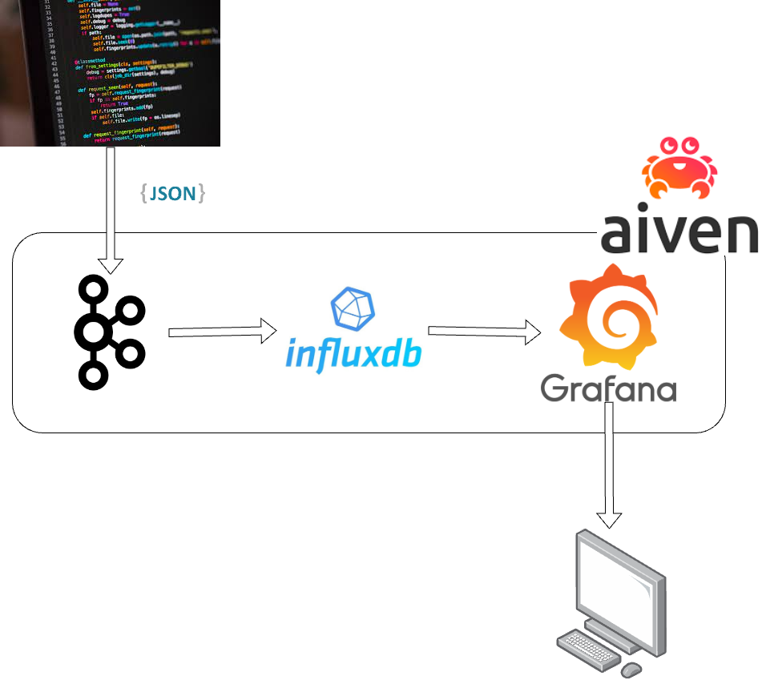

This demonstration will be totally free to follow since Aiven gives you enough free credit to POC this kind of project.

## Prerequisites:
Before we dive into the setup process, ensure that you have an [Aiven account](https://aiven.io/) and basic familiarity with cloud services and concepts.

## Create Services


### Step 1: Creating Aiven Kafka Service

Sign in to your Aiven account or create a new one if you don't have an account.
Once logged in, navigate to the Aiven dashboard and create a new Kafka service.

***

#### Create Service
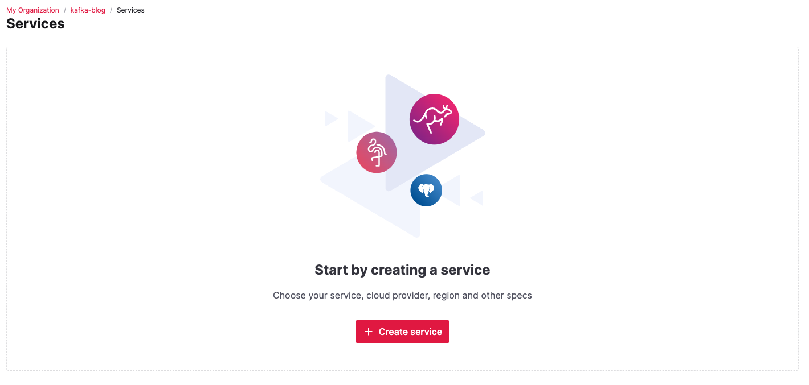

***

#### Select Kafka Service
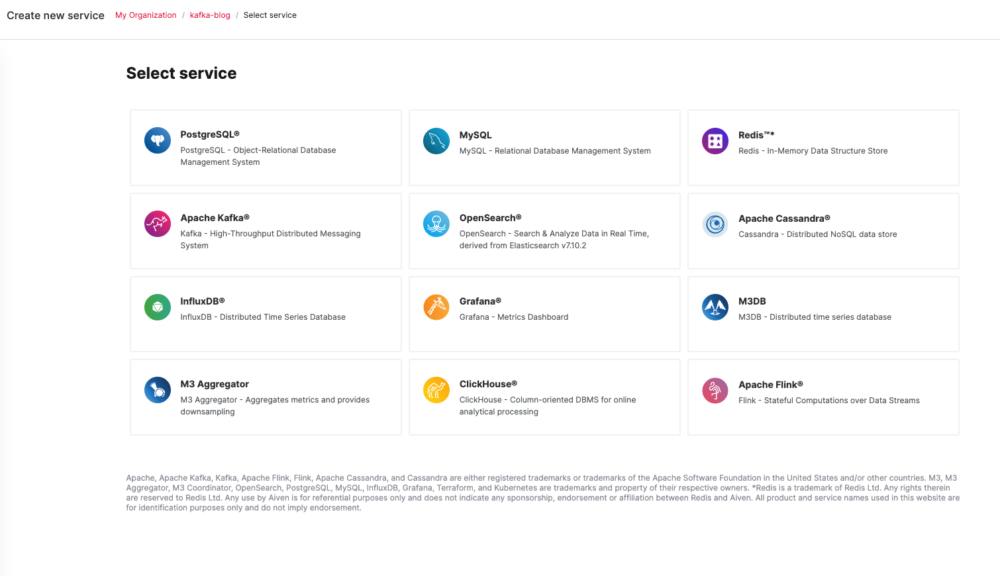


#### Configure
Select your desired cloud provider, region, and the appropriate plan for your Kafka service.
Configure the necessary parameters, including service name, project, and the number of Kafka nodes.

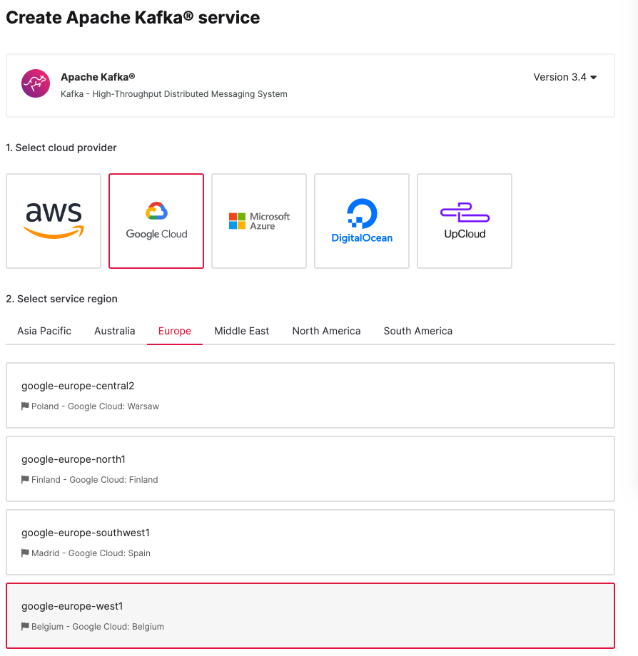

***

Don't forget to download the 3 differents certificates. We will nees them later at the coding part. You can also select your prefered language, here I will choose Python. This will shoe you next a sample app that we will augment for our demo.

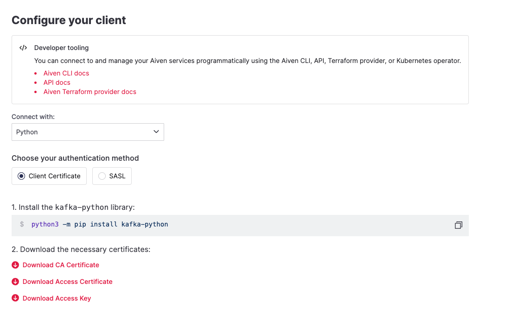

#### The Magic & The Topic
While the magic happen behind the scene you service you cannot add a topic. You just have to way for the Aiven elf plug everything and you can add your first topic. 

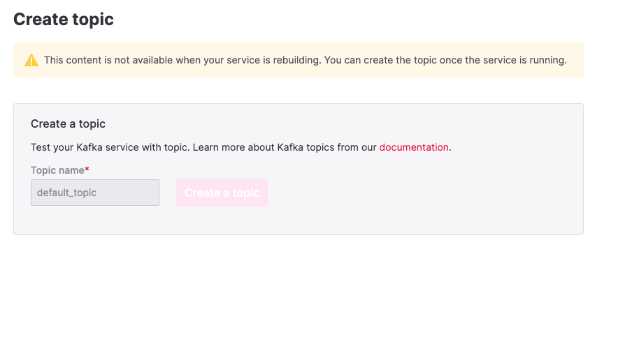

***

Here I will choose `kafka_blog` for this blog post.
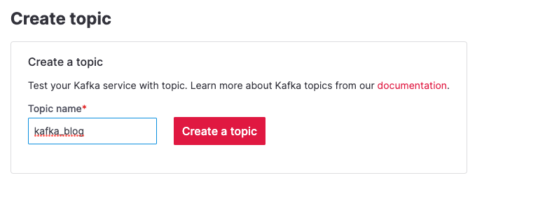


Review the configuration and create the Kafka service.


### Step 2: Connect a New InfluxDB Service

Within your Aiven account, inside your Kafka service, select the Tab "Integrations".

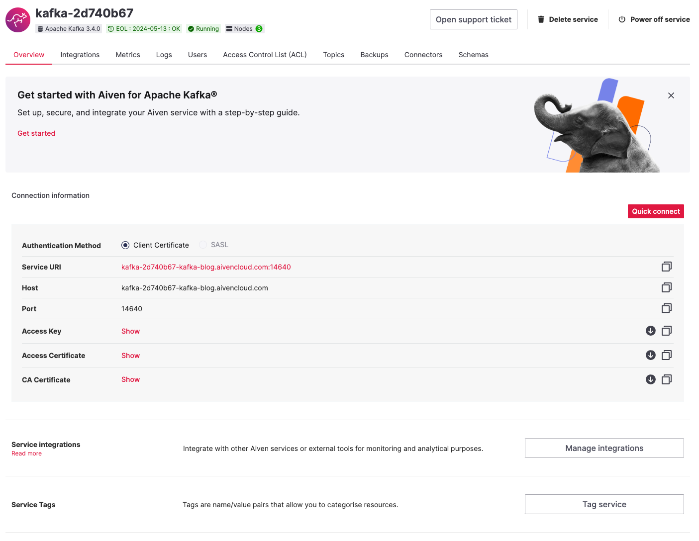

***

Select the option "Store Metrics" inside de "Aiven Solutions" part.

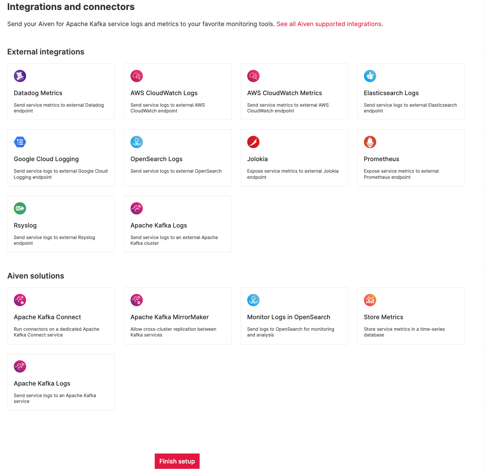

***


Then follow the flow like for Kakfa.

Select your preferred cloud provider, region, and the desired plan for your InfluxDB service.
Configure the necessary parameters, including the service name, project, and the number of InfluxDB nodes.

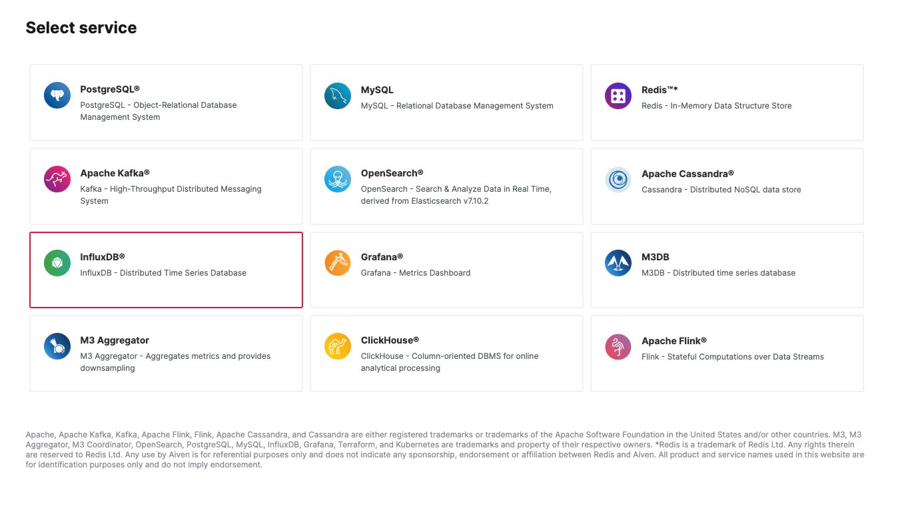

***
Since we don't have a InfluxDB instance yet, we will let the system create one for us. We could also plug Kafka to an existing instance if available.

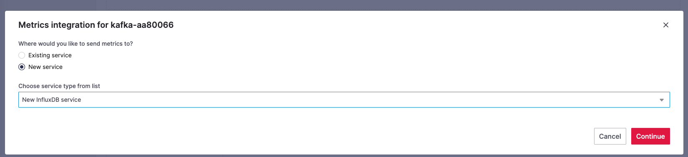

***

Carefully review the configuration and create the InfluxDB service.

***

When the service is up you should see a new InfluxDB service in your dashboard. Click on it to see all its informations

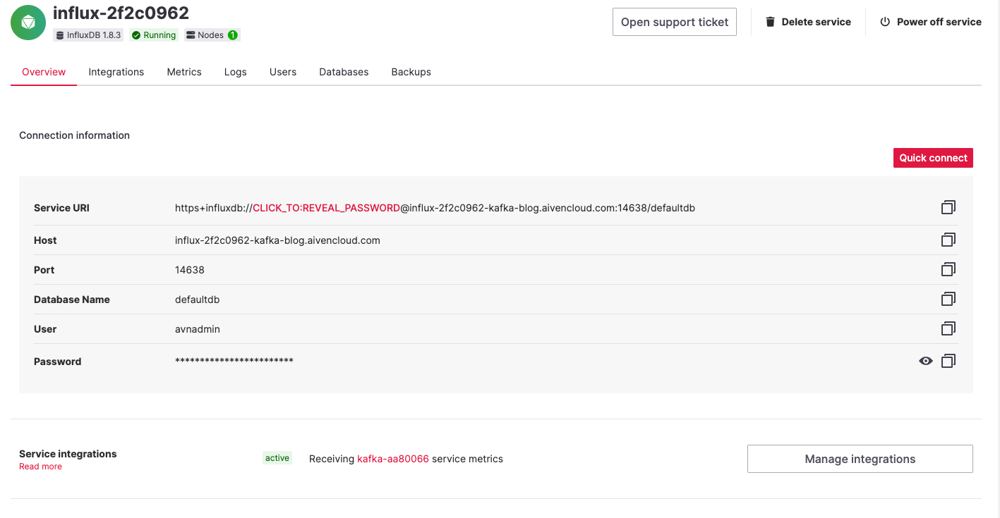

### Step 4: Creating Aiven Grafana Service as an Integration Service

Once again, we will use the very same step to start up our Grafana service and link it to InfluxDB.

Go into the Integration Tab and add a `Grafana Metrics Dashboard`

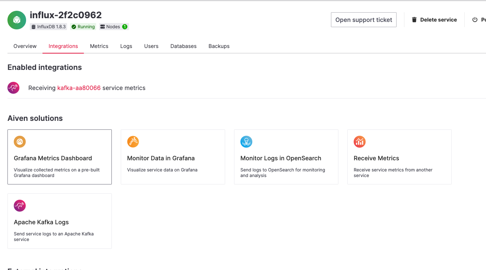

***

Now you should be use about how easy it is to play with the Aiven console.

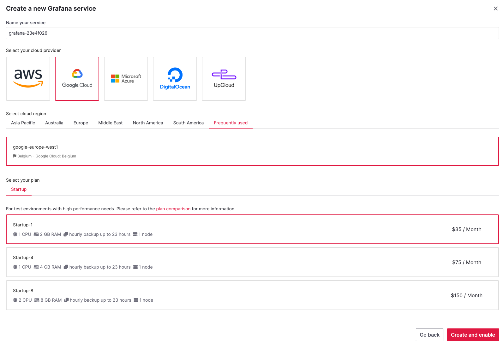

### Step 5: Connecting Grafana WebUI

Access the Grafana web interface provided by Aiven using the provided URL and login credentials in the `Overview Tab`.

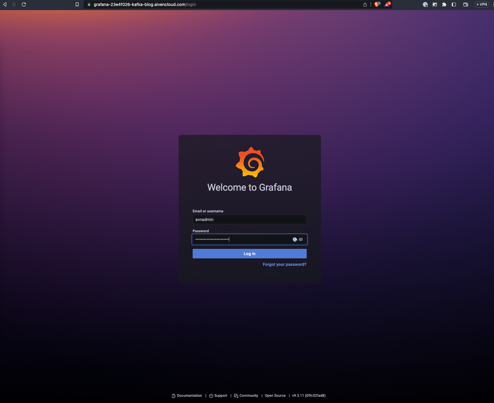

Congrats ! You have a full stack of data streaming all together.

## Let's see it into action

### Dataclass

First let create a python script named `producer.py`.

Then we will use the power of the Python [dataclasses](https://realpython.com/python-data-classes/).

We want a final JSON object with :
* sensor_id : as a `UUID` randomly generated
* temperature : as a random `float` between, let's say, 20.0 to 37.7
* humidity : as a random `float` between, let's say, 33.0 to 49.9
* timestamp : as an [ISO8601](https://www.iso.org/iso-8601-date-and-time-format.html) date of now

Also we need to transform the object to a JSON object. We we builin a method to this dataclass to use it on `self`.

```python
@dataclass
class SensorEvent:
    """Sensor template event"""
    sensor_id: str = field(default_factory=lambda: str(uuid.uuid4()))
    temperature: float = field(default_factory=lambda: random.uniform(20.0, 37.5))
    humidity: float = field(default_factory=lambda: random.uniform(33.0, 49.9))
    timestamp: datetime = field(default_factory=lambda: datetime.datetime.now().isoformat())

    def to_json(self):
        return json.dumps(self.__dict__)
```

### Kafka Producer

Then we need to intentiate our `KafkaProducer` object. For this you need to install in your python env (`pip` or my favourite `conda`) the library `kafka-python` 

```bash
$ conda install -c conda-forge kafka-python
```

From here you are able to build `producer` like :

```python
producer = KafkaProducer(
    bootstrap_servers=f"kafka-aa80066-kafka-blog.aivencloud.com:14640",
    security_protocol="SSL",
    ssl_cafile="cert/ca.pem",
    ssl_certfile="cert/service.cert",
    ssl_keyfile="cert/service.key",
)
```

Don't forget to import also the 3 certs files that you downloaded when you created your Kafka Service.

### Loop to fake streaming

Then for the simplicity of this demonstration we will simply loop 100x to generate messages and to be able to see metrics in Grafana.

```python
for _ in range(100):
    message = SensorEvent().to_json()
    producer.send(TOPIC_NAME, message.encode('utf-8'))
    print(f"Message sent: {message}")
    time.sleep(1)

producer.close()
```


### Final Code

Here the final code for this demo

```python
import json
import random
import time
import datetime
import uuid
from dataclasses import field, dataclass

from kafka import KafkaProducer

TOPIC_NAME = "kafka_blog"


@dataclass
class SensorEvent:
    """Sensor template event"""
    sensor_id: str = field(default_factory=lambda: str(uuid.uuid4()))
    temperature: float = field(default_factory=lambda: random.uniform(20.0, 37.5))
    humidity: float = field(default_factory=lambda: random.uniform(33.0, 49.9))
    timestamp: datetime = field(default_factory=lambda: datetime.datetime.now().isoformat())

    def to_json(self):
        return json.dumps(self.__dict__)


producer = KafkaProducer(
    bootstrap_servers=f"kafka-aa80066-kafka-blog.aivencloud.com:14640",
    security_protocol="SSL",
    ssl_cafile="cert/ca.pem",
    ssl_certfile="cert/service.cert",
    ssl_keyfile="cert/service.key",
)

for _ in range(100):
    message = SensorEvent().to_json()
    producer.send(TOPIC_NAME, message.encode('utf-8'))
    print(f"Message sent: {message}")
    time.sleep(1)

producer.close()
```

### Run it

Then simply run the scrip and you will be able to see the output on STDOUT as

```bash
~/Code/Aiven/Kafka_blog  ‹master› 
╰─➤  python producer.py                                                                                                                                                                         
Message sent: {"sensor_id": "0c625dbf-b74d-4203-9d43-3ccc0de59a54", "temperature": 25.175825232776656, "humidity": 35.81272957583928, "timestamp": "2023-05-23T16:42:23.581752"}
Message sent: {"sensor_id": "234ad9f1-ea47-4a6a-a828-cd5245ab64af", "temperature": 36.09907401487547, "humidity": 48.59905996131969, "timestamp": "2023-05-23T16:42:24.607987"}
Message sent: {"sensor_id": "b3d79072-0132-48af-b008-b687f5498064", "temperature": 34.19649708146366, "humidity": 45.92967617173667, "timestamp": "2023-05-23T16:42:25.613591"}
Message sent: {"sensor_id": "a4e71106-44af-4377-8e53-8fe305199ec1", "temperature": 29.632223709266622, "humidity": 35.40213335988689, "timestamp": "2023-05-23T16:42:26.619880"}
Message sent: {"sensor_id": "4fc29294-4d70-4864-bcb3-9c3766a6a1dc", "temperature": 36.78783059286242, "humidity": 44.46157614713956, "timestamp": "2023-05-23T16:42:27.626001"}
Message sent: {"sensor_id": "48cd01f0-38a7-4639-a7fb-3e9b17799781", "temperature": 20.001776108205544, "humidity": 47.294964448533406, "timestamp": "2023-05-23T16:42:28.632315"}
Message sent: {"sensor_id": "98f0ee1e-3539-43b1-8417-857dd0c2d2d8", "temperature": 29.7694803602872, "humidity": 46.49348032002804, "timestamp": "2023-05-23T16:42:29.636451"}
Message sent: {"sensor_id": "04037d7d-9b99-4c0d-ade3-d64e2cf5d254", "temperature": 20.286957859646098, "humidity": 49.368364835272224, "timestamp": "2023-05-23T16:42:30.641747"}
Message sent: {"sensor_id": "ddf050ef-c301-44ed-a4a1-8645e9e0c81c", "temperature": 23.61000513395542, "humidity": 38.19827010190306, "timestamp": "2023-05-23T16:42:31.644620"}
Message sent: {"sensor_id": "43d41cbc-44d0-46c5-b150-9eb0914c007b", "temperature": 27.517741392980522, "humidity": 34.605540366398536, "timestamp": "2023-05-23T16:42:32.652238"}
Message sent: {"sensor_id": "4b22e0d5-3e30-4ac5-bb15-56045178325d", "temperature": 32.89509768336551, "humidity": 39.422898701165686, "timestamp": "2023-05-23T16:42:33.659368"}
Message sent: {"sensor_id": "fda003d8-1ba2-404e-8c69-bb315b2b7448", "temperature": 31.901981923294265, "humidity": 46.67415253678709, "timestamp": "2023-05-23T16:42:34.664090"}
Message sent: {"sensor_id": "a4b6dd2e-31a9-4b17-8eec-b22c25b2bf70", "temperature": 31.545183382960317, "humidity": 38.57862860715537, "timestamp": "2023-05-23T16:42:35.669877"}

```

### Check on Grafana

The use Grafana it's easy too. Since we have plug Kakfa and InfluxDB into the service you already have a template dashboard to follow your Kafka Ressources.

Click in the webUI in the top left, the loupe. Look for an `Aiven Kafka*` option and click on it

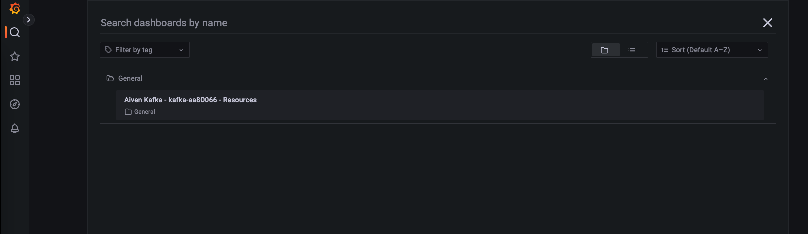

You should be able to see interesting metrics here.
From the System Metrics

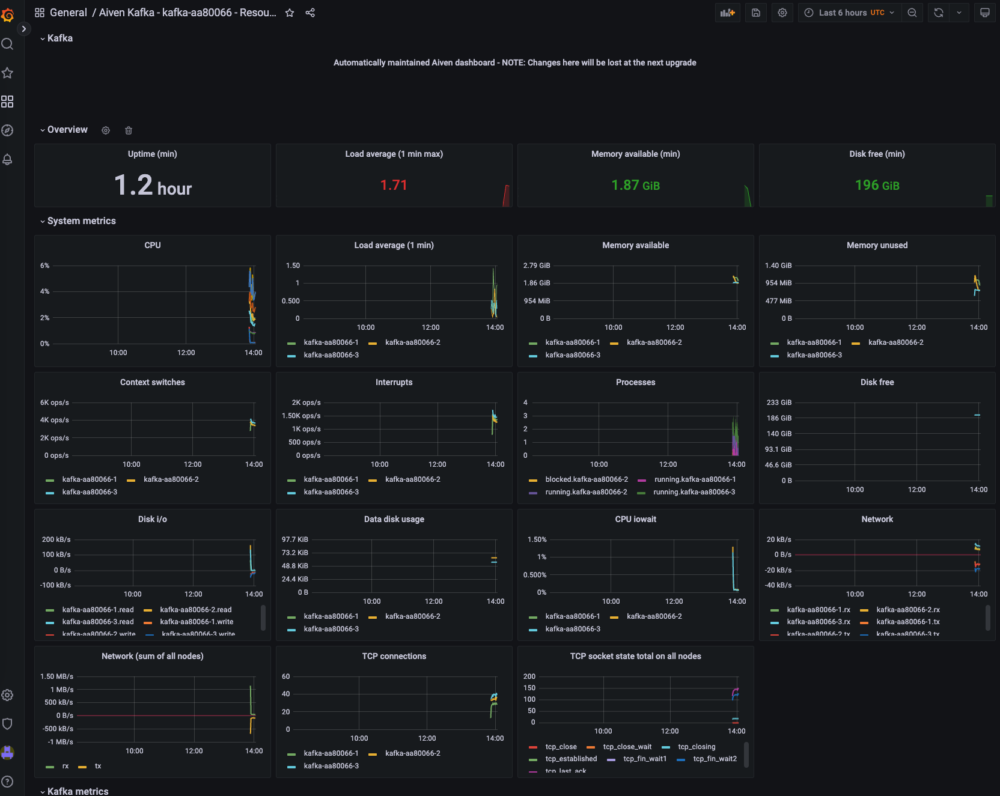

***

Or the more focused Kafka metrics

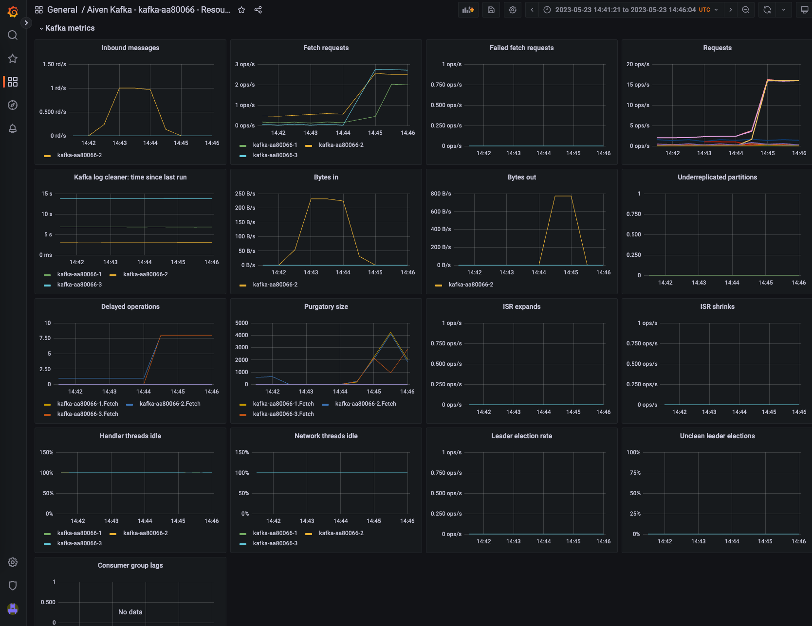

## Conclusion

In conclusion, leveraging serverless solutions like Aiven can significantly simplify and streamline development processes. By abstracting away the complexities of infrastructure management, architecture design, and tooling, developers can focus their energy and resources on the core aspects of their business. Aiven's managed services, such as Kafka, InfluxDB, and Grafana, provide reliable and scalable solutions with minimal setup and maintenance requirements. This not only reduces the total cost of ownership (TCO) but also accelerates the time to market for applications and services. Additionally, serverless solutions offer benefits such as automatic scaling, high availability, and seamless integration with other cloud services, further enhancing the efficiency and agility of development workflows. Embracing Aiven's serverless offerings empowers businesses to unlock their full potential, enabling them to innovate and deliver value to their customers more rapidly and effectively.